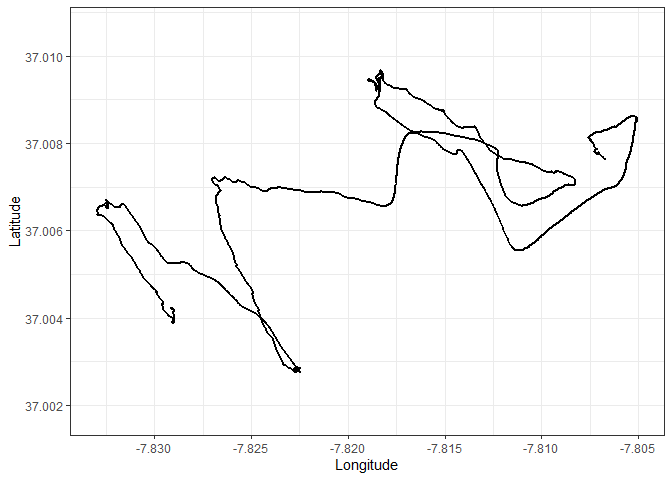
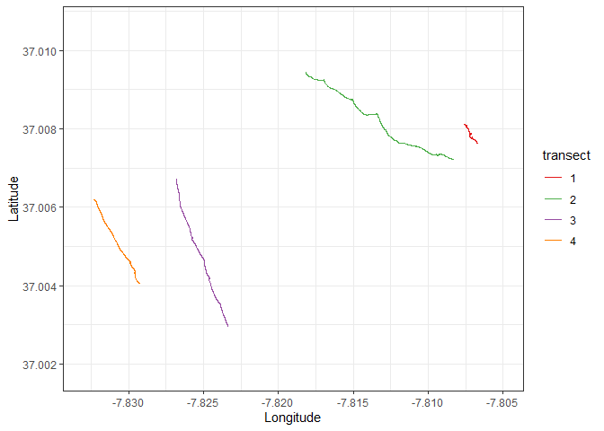
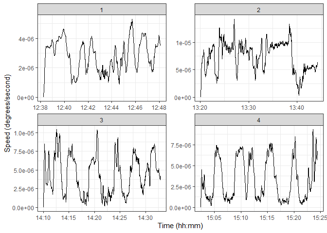
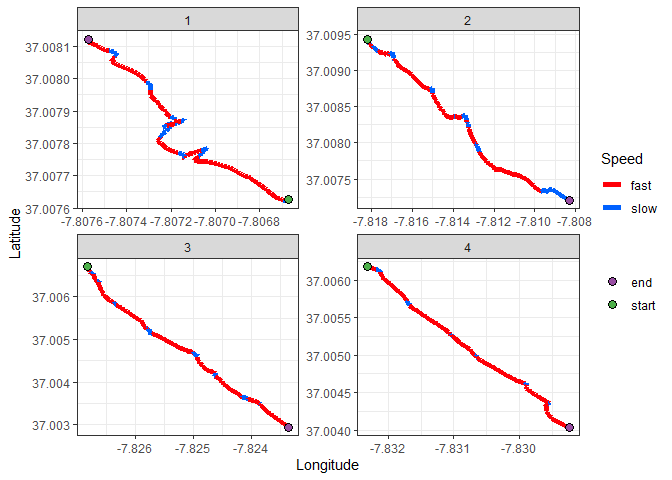
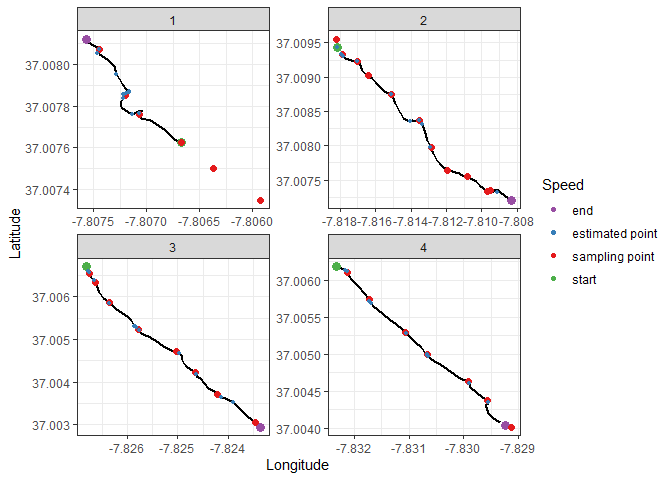

Caulerpa sampling in the Ria Formosa
================
Márcio Martins
26 Jan 2018

## *Caulerpa prolifera* sampling transects

For *Caulerpa prolifera* biomass sampling, divers performed transects
across a canal in the Ria Formosa lagoon (South Portugal) and stopped at
pre-determined intervals to collect samples.

To determine the location of those sampling points, the divers’ position
was recorded by a handheld GPS, which was attached to a diving bouy. The
GPS was recording a track, with an interval between records of 1 second.

The GPS track is continuous across all the transects, meaning it also
includes boat travel.

There are a total of 4 transects

The original method to determine the sampling points was to have a user
look at the video footage of the dives and mark the times at which
samples were taken. Then, those times were crossed with the GPS data.
This process is time consuming.

**GOALS:**  
1\. To isolate and extract the data for individual transects. 2. To
determine sampling points along the transect.  
3\. Compare automated method with manual one.

### Isolating transect data

Our GPS track was provided in “.gpx” format. For convenience, I will
convert this information into a tabular format.

There a total of 4 tracks in the device. We are only interested in the
last one.

``` r
track <- readOGR("./GPS_tracks.gpx", layer = "track_points")
```

    ## OGR data source with driver: GPX 
    ## Source: "D:\Documentos\R_resources\z_Projects\Caulerpa_sampling\GPS_tracks.gpx", layer: "track_points"
    ## with 10476 features
    ## It has 26 fields

``` r
points <- tibble("trackID" = track@data$track_fid,   #Select variables we are interested in
                 "time"    = track@data$time,
                 "lat"     = track@coords[,2],
                 "long"    = track@coords[,1]) %>%
          filter(trackID == 4) %>%                   #Only keep track 4
          select(-trackID)                           #Remove trackID variable

#Time is imported as a factor, change to POSIXct date
points$time <- as.character(points$time) %>%
               ymd_hms()

head(points)
```

    ## # A tibble: 6 x 3
    ##   time                  lat  long
    ##   <dttm>              <dbl> <dbl>
    ## 1 2018-01-25 12:38:15  37.0 -7.81
    ## 2 2018-01-25 12:38:16  37.0 -7.81
    ## 3 2018-01-25 12:38:17  37.0 -7.81
    ## 4 2018-01-25 12:38:18  37.0 -7.81
    ## 5 2018-01-25 12:38:19  37.0 -7.81
    ## 6 2018-01-25 12:38:20  37.0 -7.81

Now the information is formated in such a way that is very easy to
manipulate, and plot.

Let’s start by getting a glimpse of the full track:

``` r
#Assign a number ID to the points, it will be used to identify points later
points$nr <- c(1:nrow(points))


ggplot() +
  geom_path(data = points, aes(x = long, y = lat), size = 1) +
  lims(x = c(min(points$long), max(points$long)), y = c(37.00176, 37.01067)) +
  labs(x = "Longitude", y = "Latitude") +
  theme_bw()
```



To extract the individual transects, we need to identify the start and
end points of each transect. Those points can be identified visually. An
interactive map was used to identify the ID of those points

> note: since this work was performed, the ggmap package stopped working
> for google satellite imagery without a google developer account. The
> easiest way to change the package to mapview, which uses ESRI images).
> I did not bother changing the code, as the interactive map never
> worked in github readme anyways

Using this method, the start and end points were identified as: -
Transect one: Points 1 to 581  
\- Transect two: Points 2401 to 3811  
\- Transect three: Points 5311 to 6601  
\- Transect four: Points 8311 to 9571

``` r
t1 <- points %>%
      filter(nr <= 581)
t1$transect <- 1

t2 <- points %>%
      filter(nr >= 2401 & nr <= 3811)
t2$transect <- 2

t3 <- points %>%
      filter(nr >= 5311 & nr <= 6601)
t3$transect <- 3

t4 <- points %>%
      filter(nr >= 8311 & nr <= 9571)
t4$transect <- 4

transects <- rbind(t1,t2,t3,t4) %>%
             mutate(transect = as.factor(transect))

ggplot() +
  geom_path(data = transects, aes(x = long, y = lat, color = transect, group = transect), size = 0.5) +
  scale_color_manual(values = c("#e41a1c", "#4daf4a", "#984ea3","#ff7f00")) +
  lims(x = c(min(points$long), max(points$long)), y = c(37.00176, 37.01067)) +
  labs(x = "Longitude", y = "Latitude") +
  theme(legend.position = "none") +
  theme_bw()
```



We can also quickly create a table with the start and end times of each
transect to check if they match the video footage.

``` r
kable(transects %>%
      group_by(transect) %>%
      summarise(Start = min(time), End = max(time)),
  align = c("c","c","c"),
  format = "html") %>%
kable_styling(full_width = F)
```

<table class="table" style="width: auto !important; margin-left: auto; margin-right: auto;">

<thead>

<tr>

<th style="text-align:center;">

transect

</th>

<th style="text-align:center;">

Start

</th>

<th style="text-align:center;">

End

</th>

</tr>

</thead>

<tbody>

<tr>

<td style="text-align:center;">

1

</td>

<td style="text-align:center;">

2018-01-25 12:38:15

</td>

<td style="text-align:center;">

2018-01-25 12:48:05

</td>

</tr>

<tr>

<td style="text-align:center;">

2

</td>

<td style="text-align:center;">

2018-01-25 13:20:04

</td>

<td style="text-align:center;">

2018-01-25 13:44:15

</td>

</tr>

<tr>

<td style="text-align:center;">

3

</td>

<td style="text-align:center;">

2018-01-25 14:10:02

</td>

<td style="text-align:center;">

2018-01-25 14:32:52

</td>

</tr>

<tr>

<td style="text-align:center;">

4

</td>

<td style="text-align:center;">

2018-01-25 15:02:26

</td>

<td style="text-align:center;">

2018-01-25 15:24:27

</td>

</tr>

</tbody>

</table>

### Sampling points

Now that we have the transects, let’s to find a method to automate the
extraction of the sampling points.

My approach is going to be to estimate the speed of the divers along the
transect, and choose the sections below a certain threshold as the
sampling points.

Since speed = distance / time, and we have the time information, all we
need is the distance between the position of the divers.

We can estimate the distance between 2 points, p1 and p2 as: Distance
<sub>p1 to p2</sub> = Square root ((X<sub>2</sub> -
X<sub>1</sub>)<sup>2</sup> + (Y<sub>2</sub> -
Y<sub>1</sub>)<sup>2</sup>)

The total distance travelled from the start of the transect to any given
point *p* is then simply the cumulative sum of the distance between
points, from the start of the transect until *p*.

The diver’s speed over the previous 10 seconds is then calculated as:  
Speed<sub>past 10 seconds</sub> = (Delta Distance<sub>time - 10</sub> -
Delta Distance<sub>time</sub>)/10

At this point, I should mention that I am not going to bother projecting
this data, speeds will be estimated in degrees per second.

``` r
transects <- transects %>% 
             group_by(transect) %>%
             mutate(distance = sqrt((lat - lag(lat))^2 + (long - lag(long))^2)) 

transects$distance[is.na(transects$distance)] <- 0

transects <- transects %>%
             group_by(transect) %>%
             mutate(delta_distance = cumsum(distance - min(distance)))

transects <- transects %>%
             group_by(transect) %>%
             mutate(speed = (delta_distance - lag(delta_distance, n = 10, default = 0))/10)

ggplot(transects) +
  geom_line(aes(x = time, y = speed)) +
  facet_wrap(~ transect, scales = "free") +
  labs(x = "Time (hh:mm)", y = "Speed (degrees/second)") +
  theme_bw()
```



We can see that, while there are some clearly defined valleys in the
speed along the transect. If our assumptions are correct, those should
be our sampling points. Let’s start by performing within-transect
standardization of the speeds, using the z-score. This means that our
values are not a measure of how fast the divers are going, when compared
to other points within the same transect.

We can now map the transects, using color to represent the speed of the
divers. Red will be fast, blue will be slow:

``` r
transects <- transects %>%
             group_by(transect) %>%
             mutate(scaled_speed = (speed - mean(speed))/sd(speed),
                    extremety = case_when(nr == min(nr) ~ "start",
                                          nr == max(nr) ~ "end",
                                          TRUE ~ "no"))

ggplot() +
  geom_path(data = transects,
            aes(x = long, y = lat, color = scaled_speed), 
            size = 2) +
  scale_color_gradient(high = "#ff0008", low = "#0061ff") +
  geom_point(data = transects %>% filter(extremety %in% c("start","end")),
             aes(x = long, y = lat, fill = extremety),
             size = 3,
             shape = 21) +
  scale_fill_manual(values = points_palette) + 
  facet_wrap(~ transect, scales = "free")+
  labs(x = "Longitude", y = "Latitude", color = "Scaled speed", fill = "") +
  theme_bw()
```


A pattern is becoming clear, but due to the continuous nature of the
speed variable, it’s hard to define clear sampling points. We must now
choose a classification parameter to turn speed into a discrete
variable: slow vs fast travel speed. A bit of good old trial and error
showed that choosing the 40th quantile as a threshhold is a good
compromise. Points below that value will be classified as a slow point.

``` r
transects <- transects %>%
             group_by(transect) %>%
             mutate(quant40_speed= ifelse(scaled_speed < quantile(scaled_speed, 0.40), "slow", "fast"))

ggplot() +
  geom_path(data = transects, aes(x = long, y = lat, color = quant40_speed, group = transect), size = 2) +
  scale_color_manual(values = c("#ff0008","#0061ff")) +
  facet_wrap(~ transect, scales = "free")+
  geom_point(data = transects %>% filter(extremety %in% c("start","end")),
             aes(x = long, y = lat, fill = extremety),
             size = 3,
             shape = 21) +
  scale_fill_manual(values = points_palette) + 
  labs(x = "Longitude", y = "Latitude", color = "Speed", fill = "") +
  theme_bw()
```



We’re getting somewhere now. The blue segments are segments where the
divers were travelling slow, compared to the rest of the trasnect.

### Comparison to points determined via video footage

To classify a point as a sampling point we will say that the divers have
to be travelling at a slow speed for a minimum of 15 seconds. The
centroid of the points included in that time inverval is then classified
as a sampling point.

We can now plot the points determined using the video footage and see
how accurate we were at extracting these sampling points. The real
sampling points will be in red. The estimated sampling points in blue.

``` r
#Function that identifies when the divers are stopped and gives those points an ID number
identify_points <- function(vector,interval){
  interval <- interval - 1
  point_id <- 1                       #initialize a number to identify sampling points
  ids <- vector(mode = "numeric")     #Vector to store sampling points id number
  for(i in 1:length(vector)){
    #If x points in a row are considered slow, return TRUE (divers are stoped)
    stopped <- all(c(vector[i:i+interval]) == "slow")
    
    ids <- ids %>%          #If diver is stoped, give point an ID, else NA
           c(ifelse(stopped,
           point_id,
           NA))
    
    point_id <- ifelse(stopped, point_id, point_id + 1) #If divers are moving, increase point ID counter. This does not create a continuous ID (there are gaps), but that is not necessary
  }
  return(ids)
}

# To plot smooth transects I will average every 20 points and plot every 10th point
# This data is for ploting ONLY
transects_smooth <- transects %>%         
                    select(lat, long, nr, transect, extremety) %>%
                    group_by(transect) %>%
                    mutate(long = rollmean(long, 20, fill = NA, aling = "center"),
                           lat  = rollmean(lat, 20, fill = NA), aling = "center") %>%
                    filter(!is.na(lat)) %>%
                    .[seq(1, nrow(.), 20),]  %>% #Select every 10th point
                    ungroup()

sampling_points <- read_csv2("./sampling_points.csv") %>%  #Import the manually determined points
                   rename(transect = Transect, long = Long, lat = Lat) %>%
                   mutate(name = "sampling point")

estimated_points <- transects %>%
                    mutate(sample_points = identify_points(quant40_speed, 15)) %>%
                    filter(!is.na(sample_points)) %>%
                    group_by(transect, sample_points) %>%
                    summarise(lat = mean(lat), long = mean(long)) %>%
                    mutate(name = "estimated point") %>%
                    ungroup()

plot_points <- transects %>% ungroup %>%
               filter(extremety %in% c("start","end")) %>%
               select(transect, long, lat, name = extremety) 

plot_points <- plot_points %>%
               rbind(sampling_points %>% select(transect, long, lat, name))

plot_points <- plot_points %>%
               rbind(estimated_points %>% select(transect, long, lat, name))

ggplot() +
  geom_path(data = transects_smooth, aes(x = long, y = lat, group = transect), size = 1) +
  geom_point(data = plot_points, aes( x = long, y = lat, color = name, size = name)) +
  facet_wrap(~ transect, scales = "free") +
  scale_color_manual(values = points_palette) + 
  scale_size_manual(values = c("start" = 3, "end" = 3, "sampling point" = 2, "estimated point" = 1), guide = FALSE) +
  labs(x = "Longitude", y = "Latitude", color = "Speed", fill = "") +
  theme_bw()
```



This methodology seems to be useful to approximate sampling locations
without manually going through video footage. One pattern is also
obvious: it was much more accurate in the last 2 transects than the
first ones. There are also some points that were not detected at all.
These issues might be explained by:

  - One of the divers was using a scuba scooter for the first time, and
    the first dive was done against the current. This made speed along
    the first transect fluctuate more than in other cases  
  - In areas where there was no *Caulerpa prolifera*, the divers simply
    kept going, meaning there is no decrease in speed to detect  
  - Part of transect one was not recorded in the GPS data (memory was
    full and it was overwritten)

**Much of this can be fixed by setting some rules for field work:**  
\- Change GPS to record points every 5 seconds, rather than 1. This
increases the time we can record 5-fold, while maintaining a reasonably
high resolution (make sure to carry an extra GPS just in case)  
\- Ensure divers ALWAYS stop a minimum of 30 seconds per sampling point,
even if there is no algae to sample in the area  
\- Record transect start and end time, so that transects can be
extracted easily by filtering points between certain time periods

**The reliability of the processing can be improved by:**  
\- Smoothing the data (a simple running average would likely be enough)
to decrease noise in the data. This might not be as important if
recording interval is changed from 1 second to 5, but it’s worth looking
into  
\- As a check for accuracy of results, extract number of estimated
sampling points and see if they match real number of samples (easy to do
at this point)
