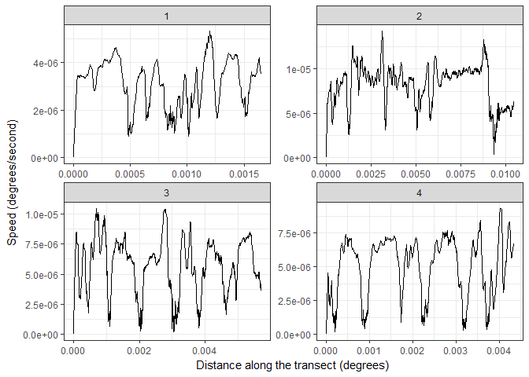
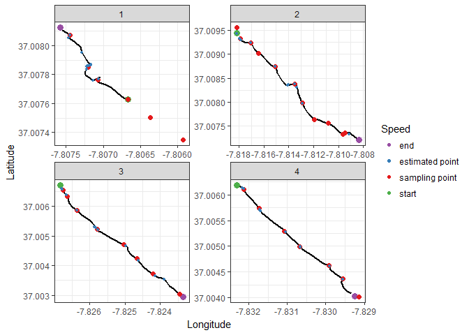

Caulerpa sampling in the Ria Formosa
================
Márcio Martins
26 Jan 2018

Caulerpa prolifera sampling transects
-------------------------------------

To determine the spatial distribution of *Caulerpa prolifera*, divers swam transects across a canal in the Ria Formosa lagoon (South Portugal) and stopped at pre-determined intervals to collect samples.

-   The track of the divers was recorded by GPS, which was on a buoy attached to divers
-   GPS track is continuous between transects, including boat travel
-   There are a total of 4 transects
-   Sampling points were also determined by having a user look at footage of the dives, mark the times at which samples were taken and them crossing them with the GPS data. These points were then used to confirm if this automatic method is accurate

**GOALS:**
1. To determine start and end point of each transect, isolate and extract them
2. Using the extracted transects, attempt to determine sampling points

### Isolating transects

Let's start by importing the tracks. File format is ".gpx". For conveniency, I will convert this information into a matrix-like format. There are 4 also tracks on record. We are only interested in the last one.

``` r
track <- readOGR("./GPS_tracks.gpx", layer = "track_points")
```

    ## OGR data source with driver: GPX 
    ## Source: "C:\Users\marci\Documents\R resources\z_Projects\Caulerpa_sampling\GPS_tracks.gpx", layer: "track_points"
    ## with 10476 features
    ## It has 26 fields

``` r
points <- tibble("trackID" = track@data$track_fid,   #Select variables we are interested in
                 "time"    = track@data$time,
                 "lat"     = track@coords[,2],
                 "long"    = track@coords[,1]) %>%
          filter(trackID == 4) %>%                   #Only keep track 4
          select(-trackID)                           #Remove trackID variable

#Time is imported as a factor, change to POSIXct date
points$time <- as.character(points$time) %>%
               ymd_hms()

head(points)
```

    ## # A tibble: 6 x 3
    ##   time                  lat  long
    ##   <dttm>              <dbl> <dbl>
    ## 1 2018-01-25 12:38:15  37.0 -7.81
    ## 2 2018-01-25 12:38:16  37.0 -7.81
    ## 3 2018-01-25 12:38:17  37.0 -7.81
    ## 4 2018-01-25 12:38:18  37.0 -7.81
    ## 5 2018-01-25 12:38:19  37.0 -7.81
    ## 6 2018-01-25 12:38:20  37.0 -7.81

Now the information is in a tibble (basically a data.frame, or a matrix). This format is very easy to manipulate, as well as plot using ggplot2.

Let's start by getting a glimpse of the full track:

``` r
#Assign a number ID to the points, it will be used to identify points later
points$nr <- c(1:nrow(points))

map <- get_map(location = c(long = -7.819869, lat = 37.00763),
               color = "color",
               source = "google",
               maptype = "satellite",
               zoom = 14)
ggmap(map) +
  geom_path(data = points, aes(x = long, y = lat), size = 1) +
  lims(x = c(min(points$long), max(points$long)), y = c(37.00176, 37.01067)) +
  labs(x = "Longitude", y = "Latitude")
```


Using this information, we need to extract the starting and ending points of each transect. Visually, I can easily find all of the tracks. Since this is possible, I will create an interactive map to allow me to extract the ID number of these points.
&gt;Due to limitations in github .md files, this does not work on the github page.

Using this interactive map we can approximate the first and last points of each trasect and obtain their ID:
\* Transect one: Points 1 to 581
\* Transect two: Points 2401 to 3811
\* Transect three: Points 5311 to 6601
\* Transect four : Points 8311 to 9571

We can now extract the transects.

``` r
t1 <- points %>%
      filter(nr <= 581)
t1$transect <- 1

t2 <- points %>%
      filter(nr >= 2401 & nr <= 3811)
t2$transect <- 2

t3 <- points %>%
      filter(nr >= 5311 & nr <= 6601)
t3$transect <- 3

t4 <- points %>%
      filter(nr >= 8311 & nr <= 9571)
t4$transect <- 4

transects <- rbind(t1,t2,t3,t4) %>%
             mutate(transect = as.factor(transect))

ggmap(map) +
  geom_path(data = transects, aes(x = long, y = lat, color = transect, group = transect), size = 0.5) +
  scale_color_manual(values = c("#e41a1c", "#4daf4a", "#984ea3","#ff7f00")) +
  lims(x = c(min(points$long), max(points$long)), y = c(37.00176, 37.01067)) +
  labs(x = "Longitude", y = "Latitude") +
  theme(legend.position = "none")
```

 The resulting transects seem accurate. However, results should be confirmed by checking starting and ending times for transects in the videos. To make this task easier, let's make a table with start/end times for the transects obtained here.

``` r
kable(transects %>%
      group_by(transect) %>%
      summarise(Start = min(time), End = max(time)),
  align = c("c","c","c"),
  format = "html") %>%
kable_styling(full_width = F)
```

<table class="table" style="width: auto !important; margin-left: auto; margin-right: auto;">
<thead>
<tr>
<th style="text-align:center;">
transect
</th>
<th style="text-align:center;">
Start
</th>
<th style="text-align:center;">
End
</th>
</tr>
</thead>
<tbody>
<tr>
<td style="text-align:center;">
1
</td>
<td style="text-align:center;">
2018-01-25 12:38:15
</td>
<td style="text-align:center;">
2018-01-25 12:48:05
</td>
</tr>
<tr>
<td style="text-align:center;">
2
</td>
<td style="text-align:center;">
2018-01-25 13:20:04
</td>
<td style="text-align:center;">
2018-01-25 13:44:15
</td>
</tr>
<tr>
<td style="text-align:center;">
3
</td>
<td style="text-align:center;">
2018-01-25 14:10:02
</td>
<td style="text-align:center;">
2018-01-25 14:32:52
</td>
</tr>
<tr>
<td style="text-align:center;">
4
</td>
<td style="text-align:center;">
2018-01-25 15:02:26
</td>
<td style="text-align:center;">
2018-01-25 15:24:27
</td>
</tr>
</tbody>
</table>
Sampling points
---------------

Now that we have the transects, let's see how accurate an automated methodology to determine sampling points would be. With one point per second, we have a pretty high resolution track for the transects. An interesting method might be to estimate diver's speeds along the transects to find stopping points.

To do so, we will: \* Calculate the total distance travelled from start of transect until current point
\* Calculate travel speed at each point.

We can the distance between any two points as:
$$Distance~from~X1~to~X2 = \\sqrt{(X\_2 - X\_1)^2 + (Y\_2 - Y\_1)^2}$$

The full distance travelled from the start of the transect to any given time is then simply the cumulative sum of distances of all previous points. To this we will call *Δ**D**i**s**t**a**n**c**e*<sub>*t**i**m**e*</sub>

With information of distance traveled and time, we can estimate their speed. The current speed at any given point will be calculated as the speed over the previous 10 seconds:
*S**p**e**e**d*<sub>*t**i**m**e*</sub> = *Δ**D**i**s**t**a**n**c**e*<sub>*t**i**m**e*</sub> − *Δ**D**i**s**t**a**n**c**e*<sub>*t**i**m**e* − 10</sub>
 Because we're only interested in how fast they are going relative to other points in the transect, I will leave distance units as degrees and will calculate speed as degrees per second.

``` r
transects <- transects %>% 
             group_by(transect) %>%
             mutate(distance = sqrt((lat - lag(lat))^2 + (long - lag(long))^2)) 

transects$distance[is.na(transects$distance)] <- 0

transects <- transects %>%
             group_by(transect) %>%
             mutate(distance = cumsum(distance - min(distance)))

transects <- transects %>%
             group_by(transect) %>%
             mutate(speed = (distance - lag(distance, n = 10, default = 0))/10)

ggplot(transects) +
  geom_line(aes(x = distance, y = speed)) +
  facet_wrap(~ transect, scales = "free") +
  labs(x = "Distance along the transect (degrees)", y = "Speed (degrees/s)") +
  theme_bw()
```



This looks interesting. I suspect it's not enough to identify all stops due to stops without coverage where the stop time was too short. Also, uncertainty in the start and end of transects makes it hard to be sure of stops at the limits.

Still, it might be interesting to plot the transects, with color based on speed. Because average speed was different amongst transects, let's increase contrast of the colors by scaling the speed. To do so, I will scale the speed within each transect. We lose information about speed differences amongst transects but keep information about the parts of a transect that were slow, compared to the rest of the transect. Scaling will be a standartization.

``` r
transects <- transects %>%
             group_by(transect) %>%
             mutate(scaled_speed = (speed - mean(speed))/sd(speed),
                    extremety = case_when(nr == min(nr) ~ "start",
                                          nr == max(nr) ~ "end",
                                          TRUE ~ "no"))

ggplot() +
  geom_path(data = transects,
            aes(x = long, y = lat, color = scaled_speed), 
            size = 2) +
  scale_color_gradient(high = "#ff0008", low = "#0061ff") +
  geom_point(data = transects %>% filter(extremety %in% c("start","end")),
             aes(x = long, y = lat, fill = extremety),
             size = 3,
             shape = 21) +
  scale_fill_manual(values = c("start" = "#33a02c", "end" = "#ff7f00")) + 
  facet_wrap(~ transect, scales = "free")+
  labs(x = "Longitude", y = "Latitude", color = "Scaled speed", fill = "") +
  theme_bw()
```


Maybe this can actually work? I can definitely see a bit of an overlap between slower (bluer) areas and "bumps" in the transects. Let's add even more contrast to this by instead using two categories to color sections: a quantile. Sections with speed below that quantile will be colored blue. A bit of trial and error showed that 40th quantile is a good compromise for all transects.

``` r
transects <- transects %>%
             group_by(transect) %>%
             mutate(quant40_speed= ifelse(scaled_speed < quantile(scaled_speed, 0.40), "slow", "fast"))

ggplot() +
  geom_path(data = transects, aes(x = long, y = lat, color = quant40_speed, group = transect), size = 2) +
  scale_color_manual(values = c("#ff0008","#0061ff")) +
  facet_wrap(~ transect, scales = "free")+
  geom_point(data = transects %>% filter(extremety %in% c("start","end")),
             aes(x = long, y = lat, fill = extremety),
             size = 3,
             shape = 21) +
  scale_fill_manual(values = c("start" = "#33a02c", "end" = "#ff7f00")) + 
  labs(x = "Longitude", y = "Latitude", color = "Speed", fill = "") +
  theme_bw()
```


We're getting somewhere now!

Plot points obtained by checking the camera
-------------------------------------------

By checking the camera footage, sampling times were determined. Times were then cross-referenced with GPS data to get the sampling point coordinates.

Let's plot them vs the points we obtained by speed.

``` r
sampling_points <- read_csv2("./sampling_points.csv") %>%
                   rename(transect = Transect)


ggplot() +
  geom_path(data = transects, aes(x = long, y = lat, color = quant40_speed, group = transect), size = 2) +
  scale_color_manual(values = c("#ff0008","#0061ff")) +
  geom_point(data = transects %>% filter(extremety %in% c("start","end")),
             aes(x = long, y = lat, fill = extremety),
             size = 3,
             shape = 21) +
  geom_point(data = sampling_points, aes(x = Long, y = Lat)) +
  facet_wrap(~ transect, scales = "free") +
  scale_fill_manual(values = c("start" = "#33a02c", "end" = "#ff7f00")) + 
  labs(x = "Longitude", y = "Latitude", color = "Speed", fill = "") +
  theme_bw()
```


